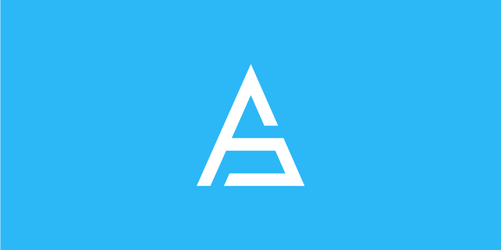

[](https://aioznetwork.github.io/aioz_dart/)
[](https://github.com/AIOZNetwork/aioz_dart/actions)
[](https://codecov.io/gh/AIOZNetwork/aioz_dart/branch/main)
[](https://pub.dev/packages/aioz_dart)
[](https://github.com/cosmos/cosmos-sdk/releases)
[](https://flutter.dev)
[](https://github.com/AIOZNetwork/aioz_dart/blob/main/LICENSE)

aioz_dart is a pure Dart package allowing you to easily integrate your Dart-based project with AIOZ Network blockchain.  

You can find the documentation on the [official website](https://aioznetwork.github.io/aioz_dart/). 

## Cosmos-SDK compatibility table
Over time, we developed different versions of this library to be compatible with multiple Cosmos SDK releases. Following you can find the compatibility table that indicates which version you should use: 

| Cosmos SDK version(s) | aioz_dart branch | 
| :-------------------: | :--------------: |
| `v0.40.x`, `v0.41.x`, `v0.42.x` | `main` |

## Getting started
To start using this library inside your project, just edit your `pubspec.yml` file adding the following lines: 

```yaml
dependencies:
  aioz_dart: <version>
```

The latest available version is:  


You can even use a specific GitHub tag or branch if you want: 

```yaml
dependencies:
  aioz_dart:
    git:
      url: git://github.com/AIOZNetwork/aioz_dart.git
      ref: <branch or tag>
```
